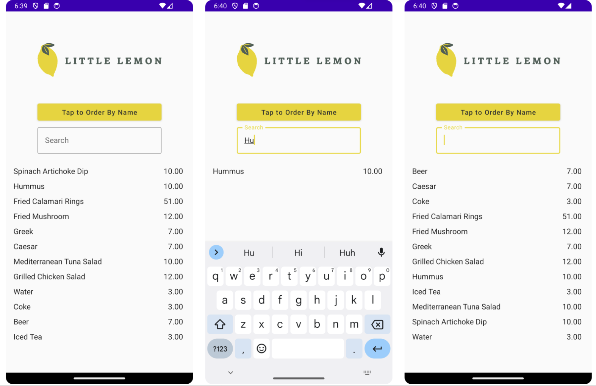

# Restaurant Menu App

## Overview

This repository contains the source code for the Restaurant Menu App, which is the final project for the Meta course [Working with Data in Android] on Coursera.
(https://www.coursera.org/learn/working-with-data-in-android)

## Project Description

The goal of this project was to improve an existing Restaurant Menu app by accomplishing the following tasks:

- Queried a REST API on a remote server and decoded the resulting JSON object into a valid Kotlin class format.
- Stored and retrieved data in a Room database.
- Added sorting and filtering functionality to display food menu data.
  
## App Screenshots

## Tech Stack

- **Kotlin**: A modern programming language that is expressive, concise, and interoperable with Java.
- **Room Database**: A persistence library that provides an abstraction layer over SQLite to allow for more robust database access.
- **REST API**: Used to fetch data from a remote server.
- **Android Studio IDE**: The official integrated development environment (IDE) for Android app development.

